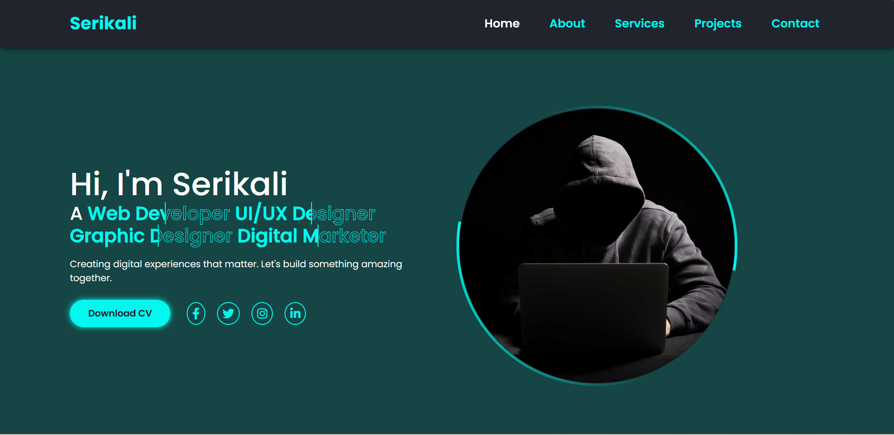

# Serikali's Portfolio 🌟

  
*A sleek, animated one-page portfolio for developers/designers, with dynamic sections, glowing theme, responsive design, and built using HTML5, CSS3, JS, and Bootstrap 5.*


## 🚀 Features
- **Dynamic Single-Page Application** with smooth section transitions  
- **Interactive Animations**: Typing effects, hover animations, and glowing UI elements  
- **Fully Responsive** design for all devices  
- **5 Key Sections**: Home, About, Services, Projects, and Contact  
- **Dark Theme** with neon accents for a sleek professional look  

## 🛠️ Technologies Used
- **Frontend**: HTML5, CSS3, JavaScript  
- **Framework**: Bootstrap 5  
- **Icons**: Font Awesome 6  
- **Design**: Custom CSS animations and transitions  

## 📂 Project Structure
```markdown
Portfolio/
├── index.html            # Main portfolio page
├── styles.css            # All custom styling
├── script.js             # Interactive functionality
├── hacker-at-night.jpg   # Profile image
├── screenshots/          # Project previews
│   ├── Welcome.png
└── README.md             # This file
```

## 🎨 Design Highlights
- **Animated Typing Text** in hero section  
- **Glowing Navigation** with active state indicators  
- **Bouncing Profile Image** with circular border animation  
- **Project Cards** with hover effects  
- **Responsive Contact Form** with validation  

## 🔧 Setup & Deployment
1. **Clone the repo**:
   ```bash
   git clone https://github.com/serikalisack/Portfolio-.git
   ```
2. **Run locally**: Open `index.html` in any browser  
3. **Deploy to GitHub Pages**:
   - Go to Settings > Pages
   - Select `main`/`master` branch
   - Your site will deploy to:  
     `https://yourusername.github.io/Portfolio-/`

## 🌐 Live Demo
[View Live Portfolio](https://serikalisack.github.io/Portfolio-/)  

## 📝 License
MIT License - Feel free to use this as a template for your own portfolio!

---

**Connect with me**:  
[](MyLinkedIn) 
[](MyTwitter) 
[](mailto:serikalidevelopment@email.com)
```


